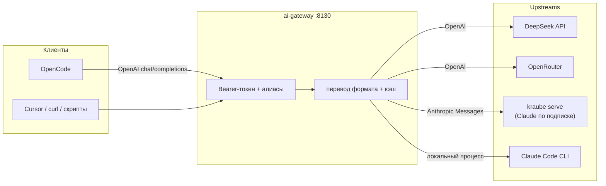

<div align="center">

# ⚡ ai-gateway

**Один OpenAI-совместимый endpoint для всех ваших LLM**

[](https://www.python.org/)
[](https://fastapi.tiangolo.com/)
[](https://github.com/Mobiss11/ai-gateway/actions/workflows/tests.yml)
[](LICENSE)

OpenCode, Cursor, скрипты — все клиенты говорят на **одном** API и с
**одним** токеном. Шлюз держит ключи провайдеров, роутит модели по
алиасам и переводит форматы на лету: OpenAI ⇄ Anthropic Messages,
включая streaming, tool-calls, extended thinking и prompt cache.

</div>



## Зачем

- **Один вход** — OpenAI-совместимый `POST /v1/chat/completions` и
  `GET /v1/models`: работает с любым клиентом, который умеет OpenAI API.
- **Секреты не покидают сервер** — ключи провайдеров живут в env-файле на
  хосте; клиенты знают только один токен шлюза.
- **Claude по подписке** — upstream `anthropic` (kraube serve) даёт
  Opus/Sonnet/Haiku через OAuth-подписку Pro/Max, с prompt cache и
  защитой от классификации third-party app (подробнее ниже).
- **Честный прокси** — тело запроса не переписывается (кроме
  формата/алиаса), ошибки не глотаются, usage не выдумывается.

Готовое решение «Claude в OpenCode по подписке» на базе этого шлюза — в
репозитории [`opencode-claude-subscription`](https://github.com/Mobiss11/opencode-claude-subscription):
install-скрипт, шаблоны конфигов, провайдер для OpenCode и разбор
extra-usage 400.

## Возможности

| | |
| --- | --- |
| 🔀 Форматы | OpenAI-проксирование как есть; `api_format: "anthropic"` — перевод в Messages API и обратно; `api_format: "claude-cli"` — локальный Claude Code CLI как upstream |
| 📡 Streaming | SSE в обоих направлениях: потоковые `tool_calls`, `thinking` → `reasoning_content` (DeepSeek-стиль) |
| 🧠 Reasoning | `reasoning_effort` / `reasoning.effort` → `output_config.effort` для Claude 5+ (adaptive thinking), `thinking.budget_tokens` для старых моделей (none → выключено) |
| ⚡ Prompt cache | `cache_control`-брейкпоинты как в Claude Code: system → инструменты → история; повторяющийся префикс ~0.1x цены |
| 🛡️ Anthropic-гоча | `move_env_to_user`: env-секция агентных клиентов переносится из system в user — иначе OAuth-подписка 400-ит «third-party app» |
| 🧰 Tools | `tools`/`tool_choice` ↔ `tool_use`/`tool_result`, картинки `data:`/`http(s)` |
| 📊 Usage | `input + cache_read + cache_creation` → `prompt_tokens`, cache-поля честно пробрасываются; опциональный usage-webhook после каждого запроса |
| 🗂️ Каталог | метаданные моделей (context/output/capabilities/variants/цены) из `GET /models` по allowlist, офлайн-сид, синк в конфиг OpenCode |
| 🔐 Безопасность | ключи только на сервере, токен-авторизация клиентов, санитизация токенов в текстах ошибок |

## Быстрый старт

Требуется [Python 3.13+](https://www.python.org/) и [uv](https://docs.astral.sh/uv/).

```bash
git clone https://github.com/Mobiss11/ai-gateway.git
cd ai-gateway
uv sync --extra dev

mkdir -p ~/.config/ai-gateway
cp config.example.json ~/.config/ai-gateway/config.json
chmod 600 ~/.config/ai-gateway/config.json
# впишите свой токен в env-файл (см. ниже)
uv run python gateway.py
```

Проверка:

```bash
curl http://127.0.0.1:8130/healthz
curl -H "Authorization: Bearer $AI_GATEWAY_TOKEN" \
     http://127.0.0.1:8130/v1/models
```

## Конфигурация

- Конфиг: `~/.config/ai-gateway/config.json`
  (переопределяется `AI_GATEWAY_CONFIG`).
- Env-файл: `~/.config/ai-gateway/env` (переопределяется
  `AI_GATEWAY_ENV_FILE`). Формат `KEY=VALUE`, `#`-комментарии,
  уже установленные переменные окружения **не перезаписываются**.

```json
{
  "listen": {"host": "127.0.0.1", "port": 8130},
  "auth": {"token": null, "token_env": "AI_GATEWAY_TOKEN"},
  "request_timeout_seconds": 300,
  "bort_usage_url": "http://127.0.0.1:8100/api/v1/ai/usage",
  "catalog_path": "~/.config/ai-gateway/catalog.json",
  "upstreams": {
    "deepseek": {
      "base_url": "https://api.deepseek.com/v1",
      "api_key_env": "DEEPSEEK_API_KEY",
      "headers": {}
    }
  },
  "models": {
    "deepseek-v4-pro": {
      "upstream": "deepseek",
      "model": "deepseek-v4-pro",
      "name": "DeepSeek V4 Pro"
    }
  }
}
```

- `auth.token` или переменная из `auth.token_env` — клиентский токен
  шлюза. Без него сервис не стартует.
- `upstreams.*.api_key_env` — имя переменной окружения с ключом
  провайдера. Ключи — только в env-файле, не в конфиге.
- `upstreams.*.headers` — дополнительные заголовки для провайдера.
- `models` — алиасы: `id` для клиента → `upstream` + настоящее имя модели.
- `catalog_path` (опционально) — каталог метаданных; без него
  `/v1/models` отдаёт минимальный формат.
- `bort_usage_url` (опционально) — usage-webhook (см. ниже).

Env-файл `~/.config/ai-gateway/env` (права `0600`):

```
AI_GATEWAY_TOKEN=придумайте-длинный-случайный-токен
DEEPSEEK_API_KEY=...
OPENROUTER_API_KEY=...
```

### Как добавить провайдера

1. Запись в `upstreams`:

```json
"myprovider": {
  "base_url": "https://api.example.com/v1",
  "api_key_env": "MYPROVIDER_API_KEY",
  "headers": {}
}
```

2. Прописать `MYPROVIDER_API_KEY` в env-файл.
3. При необходимости — алиасы в `models`.

Провайдер сразу доступен и через passthrough: id вида
`myprovider/<настоящая-модель>` уходит в этот upstream без записи в
`models`.

## Anthropic-совместимый провайдер (kraube serve)

Upstream с `"api_format": "anthropic"` говорит на Anthropic Messages API
(`POST /v1/messages`), а не OpenAI. Шлюз переводит формат на лету: клиент
по-прежнему присылает и получает OpenAI `chat/completions`, включая
streaming, tools и `usage` с cache-полями. Типичный источник — локальный
демон [`kraube serve`](https://github.com/scott-walker/kraube-api),
проксирующий Anthropic Messages через OAuth-подписку Claude
(Pro/Max/Team), без API-ключа.

```json
"upstreams": {
  "kraube": {
    "base_url": "http://127.0.0.1:8787",
    "api_key_env": "KRAUBE_SERVE_KEY",
    "api_format": "anthropic",
    "move_env_to_user": true,
    "headers": {}
  }
},
"models": {
  "claude-opus": {
    "upstream": "kraube",
    "model": "claude-opus-4-6",
    "name": "Claude Opus 4.6 (subscription)"
  }
}
```

- `base_url` — корень без `/v1` (шлюз сам дописывает `/v1/messages`);
- `api_key_env` — ключ `--auth-key` демона kraube (loopback без ключа
  kraube запускать не даст — и правильно);
- `move_env_to_user: true` — см. ниже, для kraube включён.

Запуск демона и туннеля — шаблонами LaunchAgent из `deploy/`
(`com.alluc.kraube-serve.plist.example`,
`com.alluc.kraube-proxy-tunnel.plist.example`); login один раз:
`kraube login`. Полный сценарий установки — в
[`opencode-claude-subscription`](https://github.com/Mobiss11/opencode-claude-subscription).

### Что именно переводится

- `system`/`developer`-сообщения → поле `system`; `tool_calls` ↔
  `tool_use`; tool-сообщения → `tool_result`-блоки в user-сообщении
  (подряд идущие сливаются); картинки `data:`/`http(s)` → image-блоки;
- `reasoning_effort` / `reasoning.effort`: для Claude 5+ (`claude-<opus|sonnet|haiku|fable>-N`,
  N ≥ 5; adaptive thinking всегда включён) → `output_config.effort`
  (`minimal`→`low`, `low`…`max` как есть; `none` — без поля, действует
  дефолт модели; legacy-`thinking` клиента не форвардится, явный
  `output_config` — как есть; `temperature`/`top_p` не отправляются;
  `max_tokens` по умолчанию 32768). Для остальных моделей (напр.
  Haiku 4.5) — extended thinking с `budget_tokens` по уровню (`none` —
  выключено); при включённом thinking `temperature`/`top_p` не
  отправляются. Блоки `thinking` в ответе → `reasoning_content` (как DeepSeek);
- `max_tokens` обязателен для Anthropic: если клиент не прислал — берётся
  `DEFAULT_MAX_TOKENS` (8192); при thinking бюджет всегда меньше
  `max_tokens`;
- streaming: SSE Anthropic → `chat.completion.chunk`, потоковые
  `tool_calls` собираются из `input_json_delta`; ошибки upstream
  нормализуются в OpenAI-форму `{"error": {...}}` с исходным статусом;
- молча отбрасываются поля без Anthropic-аналога (`n`, `logprobs`,
  `response_format`, `seed`, penalties, `logit_bias`, `user`);
  непереводимые роли/контент дают **явную ошибку 400**, а не тихую потерю;
- каталог anthropic-upstream'ы не опрашивает (у Messages API нет
  `GET /models`): их модели живут только в `models` конфига.

### «Third-party app»: extra-usage 400 и move_env_to_user

Anthropic классифицирует запросы сторонних агентных клиентов как
«third-party app»: они тарифицируются через **extra-usage кредиты**, а не
лимиты плана, и без кредитов детерминированно 400-ят:

```json
{"type":"error","error":{"type":"invalid_request_error",
 "message":"Third-party apps now draw from your extra usage, not your plan
  limits. Add more at claude.ai/settings/usage and keep going."}}
```

Триггер — не агентная идентичность, а **env-секция агентного клиента в
system-промпте** (`Today's date:` + «Here is some useful information
about the environment you are running in:» + `<env>…</env>`). Обычные
запросы с system проходят; любой запрос OpenCode — 400.

Решение — флаг upstream'а `move_env_to_user: true`:

- env-секция вырезается из system **целиком и дословно** (дата + интро +
  блок с тегами);
- вставляется текст-блоком в начало первого user-сообщения (после ведущих
  `tool_result`-блоков);
- модель контекст не теряет, классификация не срабатывает; незакрытый
  `<env>` не трогается; по умолчанию флаг выключен — system уходит как есть.

Дифференциальные пробы, зафиксировавшие триггер, — в
[`opencode-claude-subscription/docs/third-party-app-400.md`](https://github.com/Mobiss11/opencode-claude-subscription/blob/main/docs/third-party-app-400.md).
Короткий ретрай транзиентных 400 (лестница 0.5/1.0 c) оставлен для
не связанных с классификацией случаев; чужие 400 не ретраятся.

### Prompt caching

Anthropic-кэш неавтоматический — мост сам ставит до трёх
`cache_control: ephemeral` брейкпоинтов: на system-блоке (кэшируется весь
префикс с identity-преамбулой kraube), на последнем инструменте и на
последнем блоке предпоследнего сообщения (вся история, кроме нового
хода). Повторяющийся префикс тарифицируется как cache read (~0.1x);
`cache_read_input_tokens`/`cache_creation_input_tokens` пробрасываются в
usage честно.

## Локальный Claude Code CLI (api_format: "claude-cli")

Upstream с `"api_format": "claude-cli"` запускает официальный
[`claude`](https://code.claude.com/docs/en/cli-reference) CLI в скриптуемом
режиме `-p`. В отличие от kraube, запросы выполняет настоящий официальный
клиент: свой system prompt, свои инструменты (Read/Edit/Bash), свой учёт —
шлюз только переводит протокол. Ставится на машине, где лежат файлы
проектов.

```json
"upstreams": {
  "claude-code": {
    "api_format": "claude-cli",
    "cli_path": "/Users/you/.local/bin/claude",
    "permission_mode": "acceptEdits",
    "max_concurrent": 2,
    "allowed_project_roots": ["/Users/you"]
  }
},
"models": {
  "claude-opus": {"upstream": "claude-code", "model": "opus"}
}
```

- `cli_path` — путь к CLI; логин один раз: `claude login`;
- `permission_mode` — `default` / `acceptEdits` (авто-подтверждение правок
  файлов) / `bypassPermissions` (`--dangerously-skip-permissions`, на свой
  страх);
- `max_concurrent` — семафор параллельных процессов CLI (дефолт 2);
- `allowed_project_roots` — whitelist каталогов: рабочий каталог CLI
  извлекается из env-блока системного промпта OpenCode
  (`Working directory: /path`), вне whitelist — fallback на каталог
  сервиса;
- **ограничение протокола**: CLI — агент со своим циклом инструментов, а
  не stateless-модель. OpenAI `tools` не транслируются; для OpenCode это
  «модель без tool-calls» (executor) — в конфиге OpenCode такие модели
  объявляются с `tools: false`;
- клиентский дисконнект во время стрима убивает процесс CLI (не сжигает
  лимиты).

## Usage-webhook

`bort_usage_url` включает отчёт после **каждого** chat/completions —
успех и ошибка, стрим и не-стрим, оба api_format. Уходят только
метаданные: провайдер, модель, токены и cache-поля, `duration_ms`,
`status`/`error_code`, `external_request_id` (дедуп, 409 глотается).
Пример приёмника — [Борт](https://github.com/Mobiss11/bort-pm)
(`POST /api/v1/ai/usage`). Ошибки приёмника логируются warning'ом и не
роняют чат; промпты и ответы не покидают шлюз. Без `bort_usage_url`
отчётов нет вовсе.

## Метаданные моделей и каталог

Шлюз умеет отдавать не только alias, но и проверенные метаданные:
контекст, максимум вывода, capabilities, reasoning-efforts, native-пакет
и цену за 1M токенов. Источник — единый каталог `catalog.json` (source +
timestamp). Без каталога `/v1/models` работает как раньше.

```bash
# Офлайн-сид из sanitized-фикстур (без сети)
uv run python catalog_cli.py refresh \
  --config ~/.config/ai-gateway/config.json \
  --catalog ~/.config/ai-gateway/catalog.json \
  --aliases seed/homelab-aliases.example.json

# Живое metadata-only обновление: GET /models по allowlist upstream'ов
uv run python catalog_cli.py refresh --config ... --catalog ... --live

uv run python catalog_cli.py show   --catalog ~/.config/ai-gateway/catalog.json
uv run python catalog_cli.py export --catalog ... --out catalog.export.json
```

Правила: опрашиваются только настроенные `upstreams` (allowlist), только
`GET /models`, с ограниченным таймаутом; сеть на каждый чат не ходит;
`--live` сам подгружает env-файл шлюза. Провенанс честный (fixture/live,
`fetched_at`/`processed_at`); при сбое — last-known-good; неполные данные
не затирают точные (поля сливаются по-отдельности, `stale`-маркеры);
неизвестные значения остаются unknown, а не превращаются в «точные»
дефолты. Схема записи и инварианты валидации — в
[docs/architecture.md](docs/architecture.md).

### Синхронизация конфига OpenCode

`catalog_cli.py sync` переносит метаданные в `providers.<id>.models`
конфига OpenCode V2. По умолчанию — dry-run:

```bash
uv run python catalog_cli.py sync \
  --catalog ~/.config/ai-gateway/catalog.json \
  --config ~/.config/ai-gateway/config.json \
  --opencode /path/to/opencode.json            # dry-run
uv run python catalog_cli.py sync ... --apply  # backup 0600 + атомарная запись
```

Меняются только управляемые поля моделей, **слиянием** (пользовательские
variants/options сохраняются); `modelID`/`id` не подменяются; чужие
провайдеры, агенты и секреты не трогаются; повторный запуск идемпотентен.
`limit.output` — жёсткий максимум upstream, а не бюджет шага: применить
реальный cap можно только явно (`sync --request-output-budget N`).

## Запуск

Вручную:

```bash
uv run python gateway.py
```

LaunchAgent (macOS) — шаблон `deploy/com.alluc.ai-gateway.plist.example`:

```bash
cp deploy/com.alluc.ai-gateway.plist.example \
   ~/Library/LaunchAgents/com.alluc.ai-gateway.plist
# подставьте свои пути (или используйте install.sh из opencode-claude-subscription)
launchctl bootstrap gui/$(id -u) \
   ~/Library/LaunchAgents/com.alluc.ai-gateway.plist
tail -f ~/ai-gateway/logs/ai-gateway.out.log
```

## API

| Метод | Путь | Авторизация | Описание |
| --- | --- | --- | --- |
| GET | `/healthz` | нет | `{"status":"ok","upstreams":[...]}` |
| GET | `/v1/models` | Bearer | список alias; при наличии каталога — с limit/capabilities/reasoning/cost |
| POST | `/v1/chat/completions` | Bearer | чат, `stream: true` (SSE); для `api_format: "anthropic"` — перевод в `/v1/messages` и обратно |

Ошибки провайдера пробрасываются как есть (статус + тело). Сетевые ошибки
и таймауты → 502 в OpenAI-форме, текст санитизируется от токенов. Ключи
никогда не логируются и не возвращаются клиенту; в non-stream режиме в
лог пишутся только числовые поля `usage`.

Использование в OpenCode: base URL `http://<хост>:8130/v1`, api key —
клиентский токен шлюза.

## Безопасность

- Держите `config.json` и `env` с правами `0600` и вне git.
- Слушайте `127.0.0.1`, если шлюз не нужен другим машинам; для внешнего
  доступа используйте SSH-туннель или reverse-proxy с TLS.
- Ключи провайдеров — только на сервере, в env-файле. Не коммитьте их.
- Клиентский токен шлюза — отдельный, не равен ключам провайдеров.

## Разработка

```bash
uv sync --extra dev
uv run pytest -q
```

Тесты не ходят в сеть: HTTP-транспорт upstream подменяется
`httpx.MockTransport`, используются только фиктивные ключи. Один тест
(native-runtime proof) опционален и скипается без артефакта аудита.

PR приветствуются: код и тесты — на Rust/Python-стиль проекта, тесты к
поведению — обязательны, секреты в фикстурах — только фиктивные.

## Связанные проекты

- [`opencode-claude-subscription`](https://github.com/Mobiss11/opencode-claude-subscription) —
  готовое решение «Claude в OpenCode по подписке» на базе этого шлюза:
  install/verify-скрипты, шаблоны, разбор extra-usage 400;
- [`kraube`](https://github.com/scott-walker/kraube-api) — OAuth-прокси к
  подписке Claude (upstream `api_format: "anthropic"`).

## Лицензия

MIT — см. [LICENSE](LICENSE).
